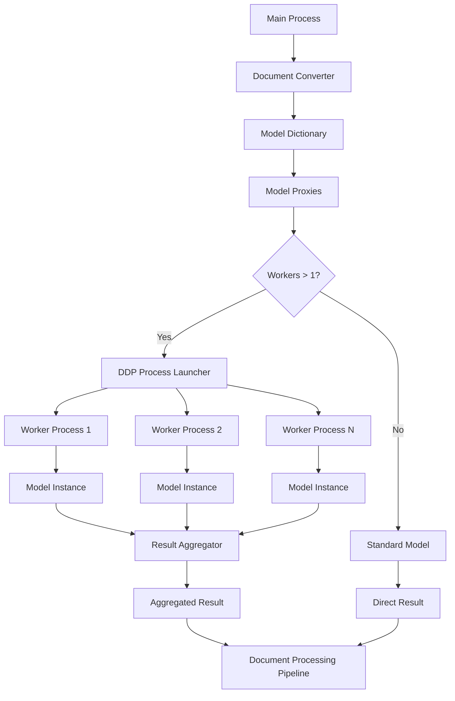

# Model-Level DDP Architecture

## Overview
This document describes the architecture for implementing model-level DDP (Distributed Data Parallel) process creation in the Marker document conversion system. The goal is to enable parallel execution of individual models within a single document processing pipeline, rather than just parallelizing multiple documents.

## Current Architecture
The current system uses:
1. **Document-level parallelism**: Multiple worker processes process different documents
2. **Internal threading**: Models use internal threading for parallel execution within a single document
3. **DDP for multi-GPU**: DDP is used at the document level for multi-GPU setups

## Proposed Architecture
The new architecture will add:
1. **Model-level parallelism**: Individual models can be executed in parallel DDP processes
2. **Dynamic process creation**: DDP processes created on-demand based on worker parameters
3. **Seamless integration**: Works alongside existing document-level parallelism

## Component Diagram



## Key Components

### 1. ModelDDPProxy
A proxy class that intercepts model calls and creates DDP processes when needed.

**Responsibilities:**
- Intercept model instantiation and execution calls
- Determine when to use DDP processes based on worker count
- Launch and manage DDP worker processes
- Aggregate results from multiple processes

### 2. DDP Process Launcher
Responsible for dynamically creating and managing DDP processes.

**Responsibilities:**
- Create specified number of worker processes
- Set up DDP environment variables
- Initialize process groups
- Handle inter-process communication
- Clean up processes after execution

### 3. Result Aggregator
Collects and merges results from multiple DDP processes.

**Responsibilities:**
- Collect results from all worker processes
- Merge results according to model-specific logic
- Handle partial failures gracefully

### 4. Enhanced Model Wrapper
Modified version of the existing model wrapping functionality.

**Changes:**
- Accept worker parameters
- Create proxies instead of direct DDP wrapping when workers > 1
- Maintain backward compatibility

## Data Flow

### 1. Model Creation with Workers
```python
# User specifies worker count
model_dict = create_model_dict(model_workers={'layout_model': 4})

# Creates proxy instead of direct model
layout_model = ModelDDPProxy(LayoutPredictor, 4, device='xpu')
```

### 2. Model Execution
```python
# When model is called
result = layout_model(images)

# Proxy decides to use DDP
if workers > 1:
    result = launch_model_ddp_processes(LayoutPredictor, 4, args, kwargs)
else:
    # Standard execution
    model = LayoutPredictor(*args, **kwargs)
    result = model(*call_args, **call_kwargs)
```

### 3. DDP Process Execution
```python
# In each worker process
dist.init_process_group(backend='ccl', rank=rank, world_size=workers)
model = LayoutPredictor(*args, **kwargs)
model = DDP(model)  # Wrap with DDP
result = model(*call_args, **call_kwargs)
# Send result back to main process
```

### 4. Result Aggregation
```python
# Main process collects results
results = collect_from_workers()
aggregated_result = aggregate_results(results)
```

## Integration Points

### 1. Configuration System
- Add worker parameters to CLI options
- Process worker configuration in config parser
- Pass worker settings to model creation

### 2. Worker Process Initialization
- Update worker initialization to handle model workers
- Pass model worker configuration to worker processes

### 3. Model Constructors
- Modify model creation to accept worker parameters
- Create proxies when workers are specified

## Performance Considerations

### 1. VRAM Management
- Calculate optimal worker count based on available VRAM
- Monitor memory usage to prevent OOM errors
- Balance load across available devices

### 2. Process Overhead
- Implement process pooling to reduce startup costs
- Reuse DDP processes when possible
- Optimize inter-process communication

### 3. Data Transfer
- Minimize data transfer between processes
- Use efficient serialization for tensors
- Implement batching where appropriate

## Error Handling

### 1. Process Failures
- Detect worker process crashes
- Implement retry mechanisms
- Gracefully fall back to single-process execution

### 2. Communication Errors
- Handle IPC failures
- Implement timeouts
- Provide meaningful error messages

### 3. Resource Management
- Ensure proper cleanup of DDP process groups
- Release GPU memory when processes exit
- Handle partial resource allocation failures

## Testing Strategy

### 1. Unit Tests
- Test proxy creation and behavior
- Verify DDP decision logic
- Test result aggregation functions

### 2. Integration Tests
- Test with actual models and real data
- Verify performance improvements
- Check resource utilization

### 3. Edge Cases
- Test with different worker counts
- Verify behavior with single worker
- Test error conditions and recovery

## Implementation Roadmap

### Phase 1: Core Infrastructure (Completed)
- Design ModelDDPProxy class
- Implement launch_model_ddp_processes function
- Enhance wrap_model_with_ddp function

### Phase 2: Process Management (In Progress)
- Create process launcher with proper environment setup
- Implement data distribution and result aggregation
- Add error handling for process failures

### Phase 3: Integration
- Modify model constructors to accept worker parameters
- Update existing models to utilize the new mechanism
- Add coordination logic between main process and DDP workers

### Phase 4: Optimization
- Add VRAM-aware process allocation
- Implement process pooling to reduce startup overhead
- Add batching mechanisms for better throughput

### Phase 5: Testing and Documentation
- Create comprehensive tests to validate functionality
- Document usage and configuration
- Provide performance tuning guidelines

## Configuration Options

### CLI Parameters
```bash
--layout_workers N        # Number of workers for layout model
--recognition_workers N   # Number of workers for recognition model
--table_workers N         # Number of workers for table model
# ... similar for other models
```

### Environment Variables
```bash
USE_MODEL_DDP=true        # Enable model-level DDP
USE_XPU_DDP=true          # Enable XPU DDP (implies model DDP)
```

### Programmatic Configuration
```python
model_workers = {
    'layout_model': 4,
    'recognition_model': 2,
    'table_rec_model': 3
}
models = create_model_dict(model_workers=model_workers)
```

## Backward Compatibility
The implementation maintains full backward compatibility:
- Existing code without worker parameters works unchanged
- DDP behavior for document-level parallelism unchanged
- CLI options are additive, not breaking changes

## Future Extensions
1. **Adaptive Worker Count**: Automatically determine optimal worker count based on workload
2. **Heterogeneous Workers**: Support different worker configurations for different models
3. **Cross-Device DDP**: Enable DDP across different device types
4. **Advanced Scheduling**: Implement work-stealing and load balancing